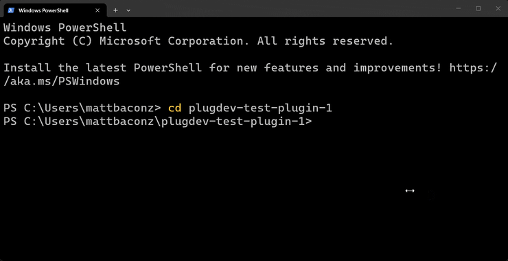
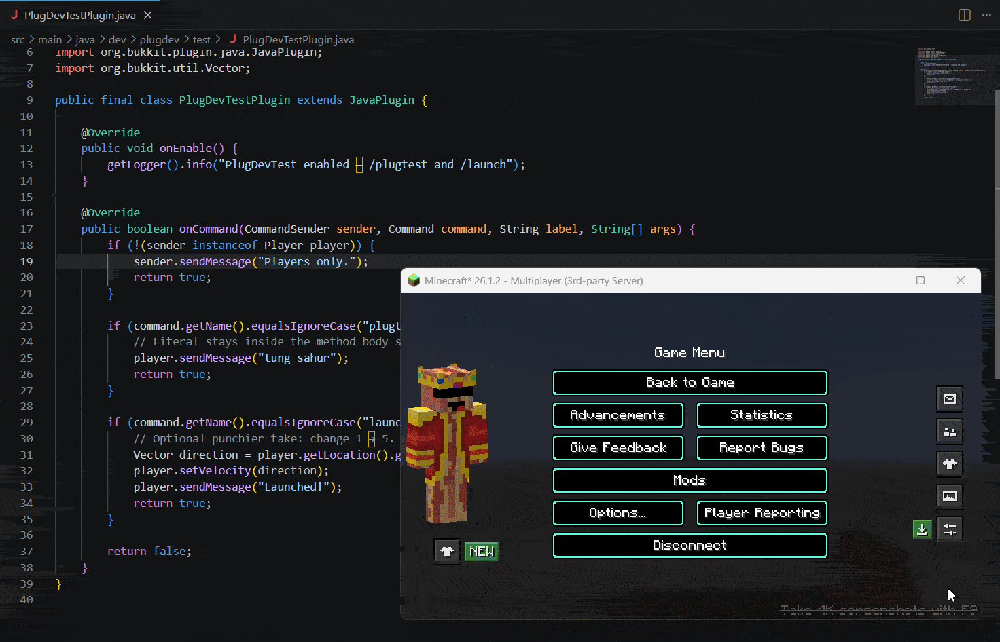
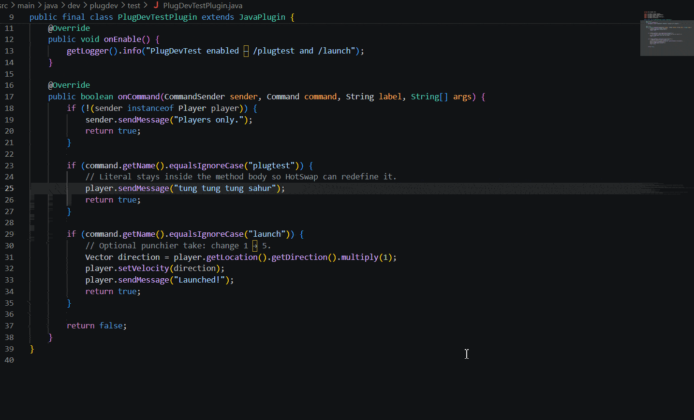

<div align="center">


# PlugDev · v0.12.4

---

**One command for the local Paper plugin test loop.**

Detect your project, boot a real server, deploy the JAR, reload on save, and join from Minecraft. Works with Gradle and Maven. No Gradle plugin required.

**[Watch the demo](https://www.youtube.com/watch?v=IFrxqWrVrLY)** · [Docs](https://pluglabs.app/plugdev) · [Discord](https://discord.gg/C4X3rThtAM)

[](https://www.npmjs.com/package/@plugdev/cli)
[](https://github.com/mattbaconz/plugdev/blob/main/LICENSE)
[](https://github.com/mattbaconz/plugdev/releases)
[](https://pluglabs.app/plugdev)
[](https://discord.gg/C4X3rThtAM)

</div>

## The problem

```text
build JAR → copy into plugins/ → restart server → open launcher → join localhost
→ find one stupid mistake → do it all again
```

PlugDev is `npm run dev` for that loop.

```powershell
npm i -g @plugdev/cli
cd your-plugin
plugdev init --setup
plug run
```

Paper, Folia, Purpur, Pufferfish, Spigot. Multi-module Maven/Gradle reactors. Safe JAR reload (not Bukkit `/reload`). Optional hotswap for method-body edits. Client join via embedded launcher or Prism.

Fabric / NeoForge / Quilt / Forge mods: PlugDev detects the loader and runs Gradle `runClient`. No plugin-style JAR reload for mod Java.

## Compared to what you already use

**Already happy with [jpenilla run-paper / run-task](https://github.com/jpenilla/run-task)?** Stay there. `./gradlew runServer` is fine for boot-with-your-JAR. PlugDev is for when you also want watch + safe reload, client auto-join, Maven, or a global `~/.plugdev` cache without editing `build.gradle`.

**Using [PaperMake](https://github.com/Rikonardo/PaperMake)?** Closest Gradle peer for safe reload + IDE debug. PlugDev does the same kind of loop as a standalone CLI: no Gradle plugin, works on Maven, can open Prism/embedded and join localhost.

**Just hotswap?** Hotswap is faster for method bodies. It does not download Paper, install deps, or launch a client. PlugDev can do `--hotswap` for the inner loop and falls back to safe reload when redefine fails (new methods/fields, `plugin.yml`, etc.).

**[MockBukkit](https://github.com/MockBukkit/MockBukkit) / [Plugwright](https://github.com/drownek/plugwright)?** Unit tests and bot E2E. Keep them. They prove logic in CI; PlugDev is the human-in-the-loop play session.

**[pluggy](https://github.com/pluggy-sh/pluggy)?** Probably the closest standalone alternative. pluggy uses its own `project.json`-based build stack, provisions a JDK, resolves dependencies, builds, tests, supports workspaces, and runs a development server with hotswap. PlugDev keeps your existing Maven or Gradle project and focuses on the playable local loop: project/module detection, targeted safe reload fallback, and launching or joining the client.

### Skip PlugDev if…

- run-paper already feels good and you do not care about client join or safe reload
- You need paperweight NMS remapping as the product (use paperweight + run-paper; PlugDev does not replace that)
- You only want automated tests (MockBukkit / Plugwright), not a local play loop

## Quick start

### Plugin

```powershell
npm install -g @plugdev/cli
cd your-plugin
plugdev init --setup
plugdev          # TUI
# or: plug run
```

### Mod

```powershell
cd your-mod
plugdev init --setup
plugdev run          # → Gradle runClient
# plugdev --loader neoforge
```

`plug` and `plugdev` are the same binary.

| Prefer… | Same as |
|---------|---------|
| `plug` / `plugdev` | Interactive TUI (TTY) |
| `plug run` | `plugdev run` |
| `plug doctor` | `plugdev doctor` |
| `plug clean` | `plugdev clean` |

**Without a global install:** `npx @plugdev/cli@latest init --setup` then `npx @plugdev/cli@latest run`.

### What happens (plugins)

Server + Via* + deps cache under `~/.plugdev/`. Project run folder: `.plugdev/run/`. Client joins `127.0.0.1:25565`. Edit `src/` → save → safe reload (or hotswap when enabled).

First boot remaps plugins (~10–30s). Later boots are faster. **Ctrl+C** stops the server; closing Minecraft does not.

### Multi-module

```powershell
plugdev module list
plugdev module use worldevents-core
# or: plug run --module worldevents-core
```

Reactor roots without a root `plugin.yml` still detect as `type: plugin` when a submodule has one. Library modules (no deployable shade/finalName) are classified separately from plugins.

## Commands

| Command | Description |
|---------|-------------|
| `plug` / `plugdev` | Interactive TUI |
| `plug run` | Full loop (plugin or mod path) |
| `plug setup` | Prefetch server/client (plugins) |
| `plug doctor` | Detect project + toolchain |
| `plug clean` | Wipe worlds or `.plugdev/run` |
| `plugdev module list\|use` | Multi-module pick |
| `plugdev deps add\|remove\|list` | Test plugins (Hangar/Modrinth) |
| `plugdev init --setup` | Config + prefetch |
| `plugdev server start\|stop\|command\|logs` | Headless server control |

### Useful flags

| Flag | Description |
|------|-------------|
| `--hotswap` | JDWP method-body redefine; falls back to safe reload |
| `--module <name>` | Build/run a reactor submodule |
| `--join` | Auto-join client |
| `--quiet` / `--json` | Less noise / structured output |
| `--loader <name>` | Mods: fabric / neoforge / forge |

## Hotswap (optional)

```powershell
plug run --hotswap
```

```yaml
watch:
  reload:
    java: hotswap
```

Default is still safe JAR reload. Hotswap is the fast path for method bodies only.

## Headless control (optional)

MCP (`npx -y @plugdev/mcp`) exposes the same loop for headless control: doctor, build, sync, server, RCON, modules, dependencies, cache, and clean. Interactive users can ignore it and use `plug run`.

## Demos

Recorded on Paper **26.1.2** with Prism + `plug run --hotswap`.







## Status

**v0.12.4** — cleaner public setup, accurate tool comparisons, and consistent release checks. See [CHANGELOG.md](CHANGELOG.md).

[Docs](https://pluglabs.app/plugdev) · [Discord](https://discord.gg/C4X3rThtAM) · [npm](https://www.npmjs.com/package/@plugdev/cli)

## Star History

<a href="https://www.star-history.com/?repos=mattbaconz%2Fplugdev&type=date&legend=top-left">
 <picture>
   <source media="(prefers-color-scheme: dark)" srcset="https://api.star-history.com/chart?repos=mattbaconz/plugdev&type=date&theme=dark&legend=top-left&sealed_token=LCuZvE-j6VXcZD6idIhXVGTLsvuYhwI1cWu-KnNKPnNMRFJLFRSpd-7j91gCVyQMXeBh0zq_ZZdrgbaZuW5EcYDTt-cumSyheYgD79-HS7aeORzdAjI-GqUftkvaKyB3Mzm79aTvK6jCb3eBogTFrCQqiGp3F0SwI_H6aWpg6W0eQF0qOUBd3CqWPeCx" />
   <source media="(prefers-color-scheme: light)" srcset="https://api.star-history.com/chart?repos=mattbaconz/plugdev&type=date&legend=top-left&sealed_token=LCuZvE-j6VXcZD6idIhXVGTLsvuYhwI1cWu-KnNKPnNMRFJLFRSpd-7j91gCVyQMXeBh0zq_ZZdrgbaZuW5EcYDTt-cumSyheYgD79-HS7aeORzdAjI-GqUftkvaKyB3Mzm79aTvK6jCb3eBogTFrCQqiGp3F0SwI_H6aWpg6W0eQF0qOUBd3CqWPeCx" />
   
 </picture>
</a>
